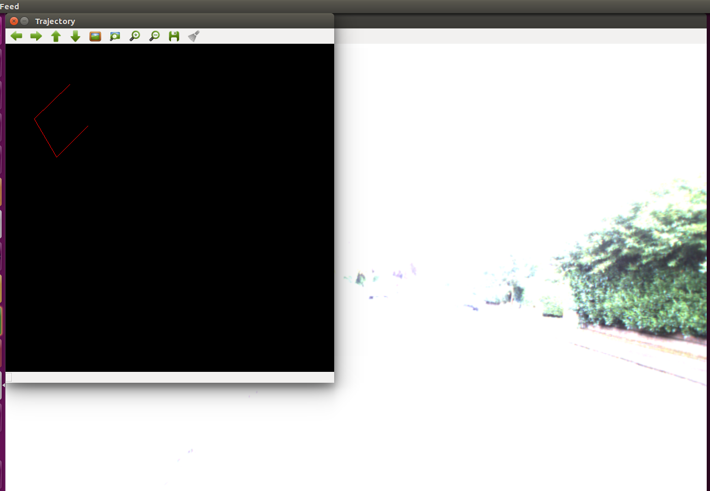
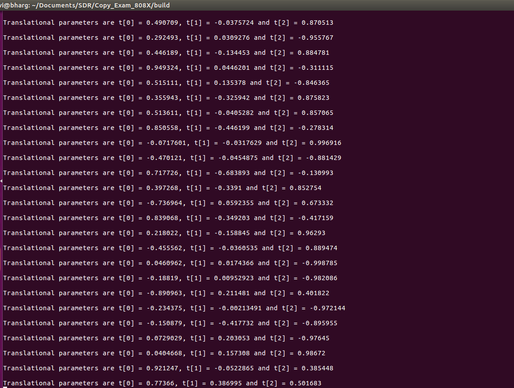

# Visual Odometry For Monocular Camera.
[](https://travis-ci.org/bhargavipatel/808X_VO)
[](https://coveralls.io/github/bhargavipatel/808X_VO?branch=master)
[](https://github.com/bhargavipatel/808X_VO/blob/master/LICENSE)
---

## Project Details

Visual Odometry is a crucial concept in Robotics Perception for estimating the trajectory of
the Robot (camera to be precise). The concepts involved in Visual Odometry are quite the
same for SLAM which needless to say is an integral part of Perception.

Steps:
- Input image is in Bayer format from which color image is recovered
- Extraction of camera parameters
- Undistort the current frame and next frame 
- Finding point correspondences
- Estimate the Fundamental matrix using these point correspondences.
- Recover Rotation and Translation matrices from Fundamental matrix.
- Ploting the position of camera center (for each frame) based on the rotation and translation
parameters between successive frames.

## Visual Odometry in Detail
Monocular or stereo, the objective of visual odometry is to estimate the pose of the robot based on some measurements from an image(s). It's hard to pin down a single core principle--Bayesian Probability Theory is likely to core principle, but epipolar geometry certainly important.

For stereo, the general idea is that if you know your camera parameters, and you know that the relationship between your camera is fixed, then a point pp that is viewed from both cameras projects onto each image plane an epipolar line segment. Using the epipolar plane defined by these line segments and the camera geometry, the distance to the point can be estimated, which can be used to estimate the pose of the robot.

For monocular vision, the task is trickier because there is only one camera. To get an image pair, an image is captured at time t; the robot is actuated, and another image is taken at time t+1 (e.g. a video stream). This pair of images can be used in the same way as any other stereo image, but because we don't know for certain the relationship between the cameras (due to deviations in motion from what the robot did and what it was instructed to do), in order to estimate the pose of the robot, the motion model has to be taken into account. In the end, monocular visual odometry is more difficult because there are more unknowns that have to be accounted for probabilistically.

The main objective is image matching. While there are numerous approaches to this problem, some approaches find feature point in the scene and match those between images to match the images themselves. A number of algorithms can be used to find feature points; SIFT is a good standard although other methods have been shown to outperform it. With features described, an algorithm that matches the points should be used; RANSAC is one such algorithm. Leveraging known relationships (such as accurate motion models or fixed cameras/projectors) can improve image matching.I am using SURF Features which yield better performance than SIFT.

## SIP Process
The SIP process metholodogy was used for the development .The product log, time log, and defect log are written in the following Document :
[SIPProcess](https://docs.google.com/spreadsheets/d/1RSP75a3Ezs6S3T3I84Ec1m85p-fogS6JML_CMYmCvE4/edit?usp=sharing)

1. Implementation of monocular visual odometry and plotting trajectory
	- This phase involved implementating the algorithm for Visual Odometry.
2. Implementation of  Unit Tests and planner
    - This stage involved creating unit tests.
3. Code Optimization & Documentation
   - During this stage, all the compiler warnings were addressed and all the program blocks were commented using Doxygen syntax. This ensures the overall quality of the software product.

UML class/activity diagrams can be found [here](https://github.com/bhargavipatel/808X_VO/tree/master/UML).
Issues Raised and Solved log can be found [here](https://github.com/bhargavipatel/808X_VO/issues)

## Plotting Trajectory and Output



## TODO
- [x] Implement the Visual Odometry for Monocular Camera. 
- [x] Apply google test to verify the implementation.
- [x] Visualize and Plotting of Trajectory.
- [x] Detailed Documentation
## Final Deliverables:
- [x] Implement the Visual Odometry for Monocular Camera.
- [x] The Unit Testing using google test
- [x] Visualization and Plotting of Trajectory.
- [x] Github README with TravisCI and Coverage of Coveralls
- [x] Detailed Documentation including Doxygen. 

## FUTURE WORK
-  Can try Real-time visual odometry from stereo data. 
-  Can Extend this project on ROS for SLAM. 
-  Implement more classes. 


## Dependencies
-  OpenCV
   OpenCV Documentation and Installation can be founnd [here](https://docs.opencv.org/trunk/d7/d9f/tutorial_linux_install.html)

## Standard install via command-line
```
git clone --recursive https://github.com/bhargavipatel/808X_VO.git
cd <path to repository>
mkdir build
cd build
cmake ..
make
Run tests: ./test/cpp-test
Run program: ./app/shell-app
```

## Building for code coverage
```
sudo apt-get install lcov
cmake -D COVERAGE=ON -D CMAKE_BUILD_TYPE=Debug ../
make
make code_coverage
```
This generates a index.html page in the build/coverage sub-directory that can be viewed locally in a web browser.

## Running cppcheck
```

```

## Working with Eclipse IDE ##

## Installation

In your Eclipse workspace directory (or create a new one), checkout the repo (and submodules)
```
mkdir -p ~/workspace
cd ~/workspace
git clone --recursive https://github.com/bhargavipatel/808X_VO.git
```

In your work directory, use cmake to create an Eclipse project for an [out-of-source build] of cpp-boilerplate

```
cd ~/workspace
mkdir -p boilerplate-eclipse
cd boilerplate-eclipse
cmake -G "Eclipse CDT4 - Unix Makefiles" -D CMAKE_BUILD_TYPE=Debug -D CMAKE_ECLIPSE_VERSION=4.7.0 -D CMAKE_CXX_COMPILER_ARG1=-std=c++14 ../cpp-boilerplate/
```

## Import

Open Eclipse, go to File -> Import -> General -> Existing Projects into Workspace -> 
Select "boilerplate-eclipse" directory created previously as root directory -> Finish

## Edit

Source files may be edited under the "[Source Directory]" label in the Project Explorer.


## Build

To build the project, in Eclipse, unfold boilerplate-eclipse project in Project Explorer,
unfold Build Targets, double click on "all" to build all projects.

## Run

1. In Eclipse, right click on the boilerplate-eclipse in Project Explorer,
select Run As -> Local C/C++ Application

2. Choose the binaries to run (e.g. shell-app, cpp-test for unit testing)


## Debug


1. Set breakpoint in source file (i.e. double click in the left margin on the line you want 
the program to break).

2. In Eclipse, right click on the boilerplate-eclipse in Project Explorer, select Debug As -> 
Local C/C++ Application, choose the binaries to run (e.g. shell-app).

3. If prompt to "Confirm Perspective Switch", select yes.

4. Program will break at the breakpoint you set.

5. Press Step Into (F5), Step Over (F6), Step Return (F7) to step/debug your program.

6. Right click on the variable in editor to add watch expression to watch the variable in 
debugger window.

7. Press Terminate icon to terminate debugging and press C/C++ icon to switch back to C/C++ 
perspetive view (or Windows->Perspective->Open Perspective->C/C++).


## Plugins

- CppChEclipse

    To install and run cppcheck in Eclipse

    1. In Eclipse, go to Window -> Preferences -> C/C++ -> cppcheclipse.
    Set cppcheck binary path to "/usr/bin/cppcheck".

    2. To run CPPCheck on a project, right click on the project name in the Project Explorer 
    and choose cppcheck -> Run cppcheck.


- Google C++ Sytle

    To include and use Google C++ Style formatter in Eclipse

    1. In Eclipse, go to Window -> Preferences -> C/C++ -> Code Style -> Formatter. 
    Import [eclipse-cpp-google-style][reference-id-for-eclipse-cpp-google-style] and apply.

    2. To use Google C++ style formatter, right click on the source code or folder in 
    Project Explorer and choose Source -> Format

[reference-id-for-eclipse-cpp-google-style]: https://raw.githubusercontent.com/google/styleguide/gh-pages/eclipse-cpp-google-style.xml

- Git

    It is possible to manage version control through Eclipse and the git plugin, but it typically requires creating another project. If you're interested in this, try it out yourself and contact me on Canvas.

## Running Unit Tests
In your build directory
```
./test/cpp-test
```

## Generating doxygen Documentation

In your git home directory. Doxygen files will be generated to /docs folder
```
doxygen Doxygen
```
For command Line. [Details](https://www.stack.nl/~dimitri/doxygen/manual/doxywizard_usage.html).
```
sudo ap-get install doxygen-gui
``` 
 
